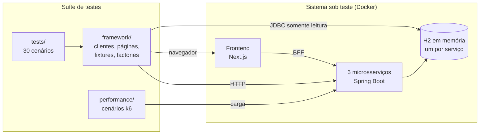

# Quality Engineering Platform — Restful Booker Platform

### Suíte de testes automatizados que encontrou 6 defeitos reais num sistema de reservas

**Playwright + TypeScript** cobrindo API, contratos, interface, banco de dados e acessibilidade.
**k6** para performance. Tudo rodando em **Docker**, publicado por **GitHub Actions**.

[](https://github.com/MarcosQuintino0/quality-engineering-platform-rbp/actions/workflows/main.yml)
[](https://github.com/MarcosQuintino0/quality-engineering-platform-rbp/actions/workflows/pull-request.yml)
[](https://playwright.dev)
[](https://www.typescriptlang.org)
[](https://k6.io)
[](https://docs.docker.com/compose/)
[](https://marcosquintino0.github.io/quality-engineering-platform-rbp/)
[](https://github.com/MarcosQuintino0/quality-engineering-platform-rbp/releases/latest)
[](LICENSE)


---

## Resultados

|                                                     |                                 |
| --------------------------------------------------- | ------------------------------- |
| **30 cenários** automatizados                       | 100% aprovados                  |
| **6 defeitos reais** encontrados no sistema testado | todos com reprodução verificada |
| **Suíte completa em 15 segundos**                   | execução paralela, 8 workers    |
| **3 execuções seguidas sem retry** no CI            | zero reprovadas                 |
| **5.246 req/s** no ponto de saturação               | p(95) de 17,2 ms                |
| **Clone limpo funciona de primeira**                | 30/30 seguindo apenas o README  |

**[Ver o relatório Allure ao vivo →](https://marcosquintino0.github.io/quality-engineering-platform-rbp/)**

---

## Os 6 defeitos encontrados

Nenhum deles é hipótese. Cada um tem passo de reprodução verificado em
[`docs/known-issues.md`](docs/known-issues.md).

| Defeito                                                          | Severidade |
| ---------------------------------------------------------------- | ---------- |
| **Criação concorrente devolve o identificador de outro recurso** | alta       |
| Frontend em container não alcança as APIs                        | alta       |
| Excluir um quarto deixa reservas órfãs no banco                  | alta       |
| Reserva conflita consigo mesma ao ser atualizada                 | alta       |
| Consulta de quarto excluído devolve 500 em vez de 404            | média      |
| Criar reserva gera mensagem de contato não solicitada            | baixa      |

### O achado principal

O CI acusou dois testes intermitentes com mensagens **impossíveis**: `409` ao
reservar um quarto criado dentro do próprio teste, e `404` ao atualizar uma
reserva criada segundos antes.

Quando a mensagem descreve algo impossível, a premissa é que está errada — e
estava: **a criação devolvia o identificador de outro recurso.**

Um script de reprodução independente confirmou:

```
150 criações simultâneas
  respostas com dados de outro quarto : 11
  identificadores duplicados          : 10
  falhas HTTP                         : 0
```

Nenhuma requisição falhou. **Todas devolveram `201`. Onze devolveram o recurso
errado.** A causa é uma única conexão JDBC compartilhada entre threads somada a
`SELECT LAST_INSERT_ID()`, que é escopado por conexão.

Traduzindo para o negócio: dois hóspedes reservando ao mesmo tempo podem receber,
cada um, o número de reserva do outro. A partir daí, cancelar a própria reserva
cancela a do outro.

---

## O que este projeto demonstra

**Automação**
Playwright com TypeScript em modo estrito · testes de API sem cliente HTTP extra ·
Page Objects orientados a comportamento · fixtures, factories e limpeza automática ·
massa determinística com semente · execução paralela sem acoplamento

**Qualidade além do teste passar**
Validação de contratos com Ajv · verificação de persistência lendo o banco direto ·
acessibilidade com axe e baseline · testes de carga com limites derivados de medição

**Engenharia**
Ambiente completo em Docker Compose · CI/CD com quatro workflows · Allure publicado
no GitHub Pages com histórico · quality gates que bloqueiam merge · Dependabot e
secret scanning

**Diagnóstico**
Três instabilidades investigadas até a causa raiz, **nenhuma resolvida com retry ou
timeout maior**. Uma delas revelou o defeito de concorrência acima.

---

## Veja funcionando

### Relatório Allure, publicado a cada execução


**[Abrir o relatório →](https://marcosquintino0.github.io/quality-engineering-platform-rbp/)**

### Performance com k6


Repare no limite separado para `{operacao:criar_reserva}`. A escrita percorre a
regra de disponibilidade e grava no banco, então é mais cara que uma consulta;
medi-la junto com as leituras faria o volume de consultas diluir uma degradação
na escrita.

Os limites vieram de medição, não de estimativa: o ponto de saturação foi medido
**antes** de qualquer threshold ser escrito.

---

## Como executar

Só precisa de **Node 22+**, **Docker** e **Git**. Java, Maven e k6 rodam em
container — nada é instalado na sua máquina.

```bash
git clone https://github.com/MarcosQuintino0/quality-engineering-platform-rbp.git
cd quality-engineering-platform-rbp
npm ci
cp .env.example .env
npm run env:up
npx playwright test
```

O `env:up` clona o sistema testado num commit fixo, compila os seis serviços Java
num container Maven e sobe tudo. Verificado: **clone limpo, seguindo apenas estes
comandos, 30 de 30 aprovados em 28 segundos.**

| Comando                 | O que faz               |
| ----------------------- | ----------------------- |
| `npm test`              | Os 30 cenários          |
| `npm run test:api`      | Camada de API           |
| `npm run test:ui`       | Interface               |
| `npm run test:database` | Persistência em banco   |
| `npm run perf:mixed`    | Carga combinada com k6  |
| `npm run env:status`    | Diagnóstico do ambiente |

---

## Os 30 cenários

Distribuídos seguindo a pirâmide: base larga em API, topo estreito em interface.

| Camada                   | Cenários | Por quê                                                |
| ------------------------ | -------- | ------------------------------------------------------ |
| API                      | 12       | Rápido, estável e aponta o serviço culpado             |
| Interface                | 9        | O único que prova que a pessoa consegue usar o sistema |
| Contratos                | 4        | Uma mudança de formato quebra consumidores em silêncio |
| Integração entre camadas | 2        | Cada fronteira é um ponto onde o dado se perde         |
| Persistência em banco    | 2        | Confirmar pela mesma API que escreveu é circular       |
| Acessibilidade           | 1        | Barreira estrutural nas telas do caminho principal     |

<details>
<summary><strong>Ver o catálogo completo</strong></summary>

**API — QEP-001 a QEP-012**
Sessão válida é utilizável · credenciais inválidas rejeitadas · operação protegida
bloqueada · criação, consulta, atualização e exclusão de quarto · criação, filtro,
atualização e exclusão de reserva · mensagem de contato

**Contratos — QEP-013 a QEP-016**
Contrato de sessão em `Set-Cookie` · forma do quarto nas três representações ·
envelope da reserva · payload inválido devolve todos os campos em `fieldErrors`

**Interface — QEP-017 a QEP-025**
Login válido e inválido · criação, edição e exclusão de quarto · jornada completa
de reserva · campos obrigatórios · combinação inválida de datas · contato

**Integração, banco e acessibilidade — QEP-026 a QEP-030**
Quarto criado pela API e reservado na interface · reserva da API na administração ·
persistência da atualização no banco · exclusão atinge só a linha certa ·
acessibilidade das páginas críticas

A [matriz de rastreabilidade](docs/traceability-matrix.md) liga cada cenário ao
risco que cobre, ao arquivo e ao momento do pipeline.

</details>

---

## Arquitetura



A suíte fala com **as três camadas**, e é isso que permite provar em vez de
supor: uma reserva confirmada na tela é conferida pela API, e um valor gravado
pela API é conferido no banco.

---

## Stack

|                    |                                                 |
| ------------------ | ----------------------------------------------- |
| **Automação**      | Playwright Test, TypeScript estrito             |
| **Contratos**      | Ajv + ajv-formats                               |
| **Massa de dados** | Faker com semente determinística                |
| **Acessibilidade** | axe-core, WCAG 2.0 e 2.1 níveis A e AA          |
| **Banco**          | Ferramenta JDBC somente leitura em container    |
| **Performance**    | k6                                              |
| **Ambiente**       | Docker Compose                                  |
| **CI/CD**          | GitHub Actions, 4 workflows                     |
| **Relatório**      | Allure com histórico, publicado no GitHub Pages |
| **Qualidade**      | ESLint, Prettier, Dependabot                    |

---

## Documentação técnica

Estratégia de testes, matriz de riscos, arquitetura detalhada, quality gates,
estratégia de massa de dados, política de testes instáveis, estratégia de
performance, limitações conhecidas e quatro registros de decisão arquitetural
(ADR) estão em **[`docs/`](docs/)**.

---

## Créditos

O **Restful Booker Platform** é criação de
[Mark Winteringham](https://github.com/mwinteringham), sob GPL-3.0, usado aqui
como dependência externa — sem cópia, alteração ou redistribuição de código.

Este repositório é licenciado sob [MIT](LICENSE).

## Autor

**Marcos Quintino** — [github.com/MarcosQuintino0](https://github.com/MarcosQuintino0)
