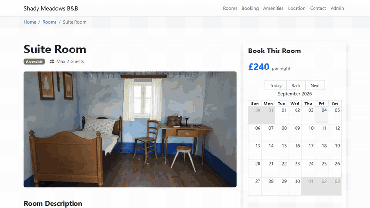
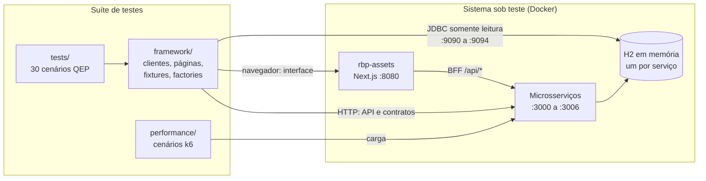
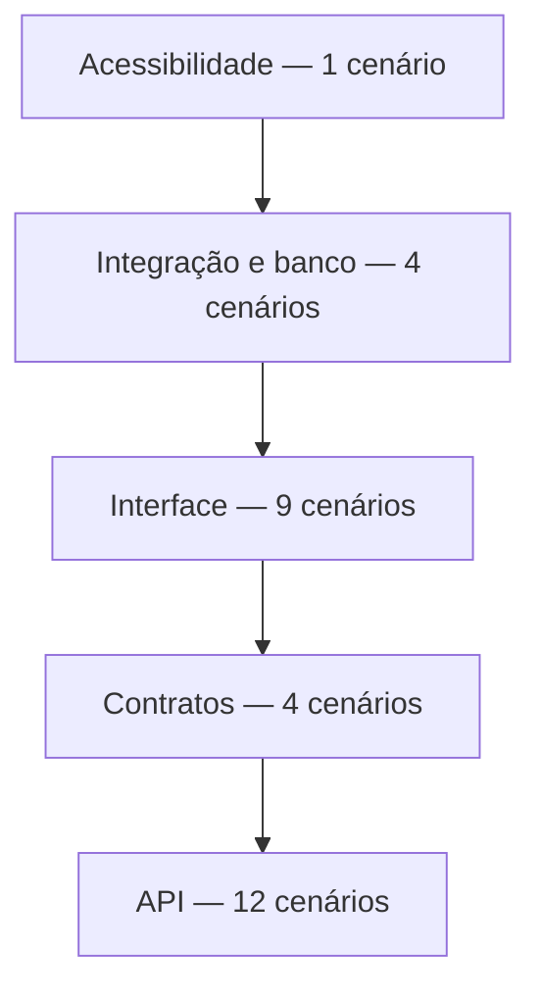
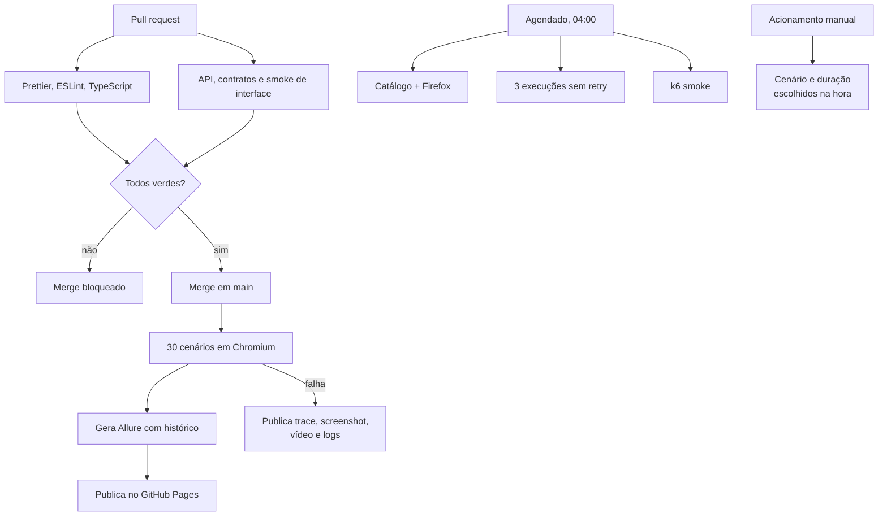
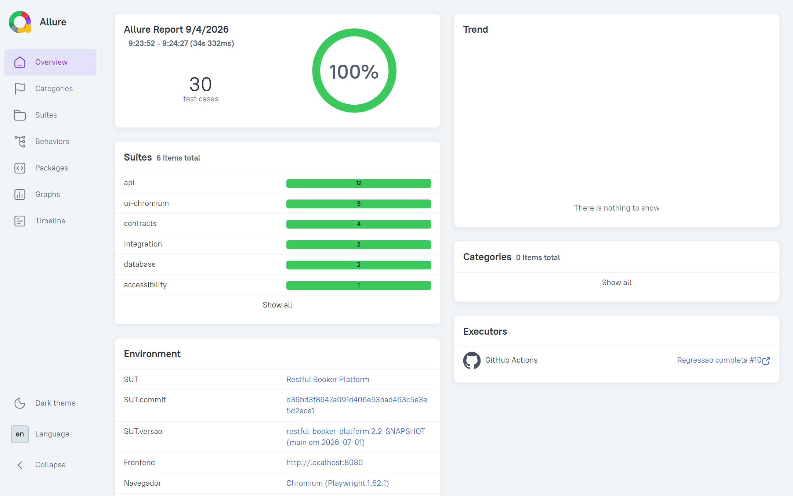
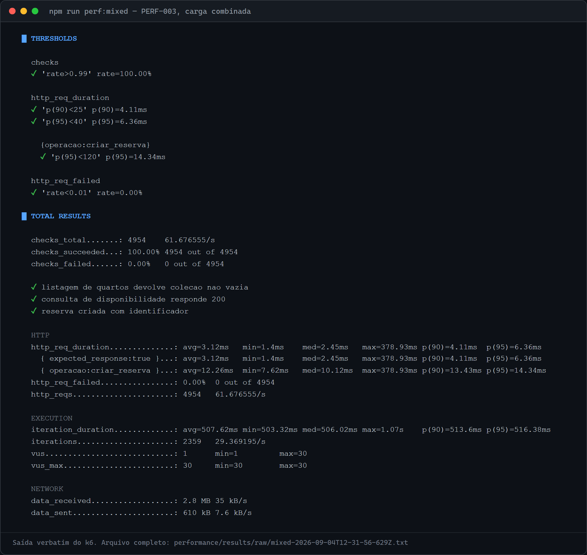

# Quality Engineering Platform — Restful Booker Platform

**Suíte de testes automatizados que prova o que afirma.** Trinta cenários em
Playwright e TypeScript cobrindo API, contratos, interface, integração entre
camadas, persistência em banco e acessibilidade — mais performance com k6 —
sobre o [Restful Booker Platform](https://github.com/mwinteringham/restful-booker-platform),
executado localmente em Docker a partir de um commit fixo.

[](https://github.com/MarcosQuintino0/quality-engineering-platform-rbp/actions/workflows/main.yml)
[](https://github.com/MarcosQuintino0/quality-engineering-platform-rbp/actions/workflows/pull-request.yml)
[](https://playwright.dev)
[](https://www.typescriptlang.org)
[](https://k6.io)
[](https://docs.docker.com/compose/)
[](https://marcosquintino0.github.io/quality-engineering-platform-rbp/)
[](https://github.com/MarcosQuintino0/quality-engineering-platform-rbp/releases/latest)
[](LICENSE)



---

## Resumo executivo

Uma suíte de testes vale pelo que consegue provar, não pelo tamanho. Este
projeto tem trinta cenários porque cada um cobre um risco identificado; um
cenário sem risco associado não entra, por mais fácil que seja de escrever.

O que distingue esta suíte:

- **Verificação cruzada.** Uma reserva confirmada na tela é confirmada pela API;
  um valor gravado pela API é confirmado no banco. Verificar uma escrita pela
  mesma camada que a fez é circular e não prova persistência.
- **Seis defeitos reais encontrados** no sistema testado, cada um com passo de
  reprodução verificado. Nenhum deles virou asserção: assertar o bug o
  transformaria em contrato protegido pela própria suíte.
- **Três instabilidades investigadas até a causa**, sem aumentar timeout e sem
  retry. A terceira revelou um defeito de concorrência no próprio sistema
  testado, reproduzido por script independente.
- **Limites de performance derivados de medição**, não de estimativa. O ponto de
  saturação foi medido antes de qualquer threshold ser escrito.

## O problema que este projeto resolve

Sistemas de reserva falham de maneiras que testes superficiais não detectam. A
tela mostra "reserva confirmada" e nada foi gravado. A API responde 202 e o
registro continua no banco. O contrato muda de forma e o consumidor quebra em
silêncio, porque o status continua 200.

Esta suíte foi construída para responder a essas perguntas com evidência, e não
com suposição.

## Sistema sob teste

O [Restful Booker Platform](https://github.com/mwinteringham/restful-booker-platform)
é uma plataforma de reservas de hospedagem criada por Mark Winteringham para
treinamento em testes. São seis serviços Spring Boot com banco H2 embarcado e um
frontend Next.js.

| Item          | Valor                                                     |
| ------------- | --------------------------------------------------------- |
| Commit fixado | `d36bd3f8647a091d406e53bad463c5e3e5d2ece1` (2.2-SNAPSHOT) |
| Serviços      | auth, booking, room, branding, message, report            |
| Frontend      | Next.js, com camada BFF em `/api/*`                       |
| Banco         | **H2 em memória, um por serviço** — não PostgreSQL        |
| Licença       | GPL-3.0                                                   |

O commit é fixado para que contratos e comportamento observados sejam
reproduzíveis. O código do SUT **não é copiado nem alterado** por este
repositório: é clonado em tempo de preparação para `.sut/`, fora do
versionamento. Ver [ADR 0004](docs/decisions/adr-0004-licenciamento.md).

## Arquitetura



Detalhes, diagramas das camadas e da jornada ponta a ponta em
[docs/architecture.md](docs/architecture.md).

## Stack

| Camada         | Ferramenta                   | Por quê                                                                                   |
| -------------- | ---------------------------- | ----------------------------------------------------------------------------------------- |
| Executor       | Playwright Test              | Um executor para API e interface, com trace nativo                                        |
| Linguagem      | TypeScript estrito           | `noUncheckedIndexedAccess` e `strictNullChecks` ativos                                    |
| API            | `APIRequestContext`          | Sem dependência extra de cliente HTTP                                                     |
| Contratos      | Ajv + `ajv-formats`          | Valida schema e formatos, relatando todos os desvios de uma vez                           |
| Massa          | Faker com semente            | Determinismo por execução, isolamento por worker                                          |
| Acessibilidade | `@axe-core/playwright`       | Regras WCAG 2.0 e 2.1, níveis A e AA                                                      |
| Banco          | Ferramenta JDBC em container | H2 não tem driver maduro em Node ([ADR 0003](docs/decisions/adr-0003-acesso-ao-banco.md)) |
| Performance    | k6 em container              | Sem exigir instalação global                                                              |
| Ambiente       | Docker Compose               | Sobe o SUT completo a partir do commit fixado                                             |
| Relatório      | Allure                       | Histórico entre execuções, publicado no Pages                                             |
| Qualidade      | ESLint + Prettier            | Verificados no pipeline                                                                   |

As versões exatas de cada dependência estão em `package.json` e
`package-lock.json`, que são a fonte da verdade. Os badges acima nomeiam as
ferramentas, e não versões, para não passarem a mentir a cada atualização do
Dependabot.

**PostgreSQL não é usado.** O SUT usa H2 em memória, e afirmar o contrário no
README seria falso.

## Estratégia de testes

A distribuição segue a pirâmide: base larga em API, onde o teste é rápido,
estável e aponta o serviço culpado; topo estreito em interface, onde o teste é
caro mas é o único que prova que a pessoa consegue usar o sistema.



Os nove cenários de interface não repetem o que a API já cobriu: verificam o que
só existe na tela. A estratégia completa está em
[docs/test-strategy.md](docs/test-strategy.md).

## Matriz de riscos

| Risco                                        | Classificação | Cenários                              |
| -------------------------------------------- | ------------- | ------------------------------------- |
| R1 — Sessão administrativa burlada           | alto          | QEP-001, 002, 003, 013, 017, 018      |
| R2 — Reserva perdida ou incorreta            | **crítico**   | QEP-008, 010, 015, 022, 026, 027, 028 |
| R3 — Disponibilidade errada gera overbooking | alto          | QEP-009, 010, 024, PERF-003           |
| R4 — Contrato quebra sem aviso               | alto          | QEP-013, 014, 015, 016                |
| R5 — Exclusão inconsistente                  | médio         | QEP-004 a 007, 011, 021, 029          |
| R6 — Interface bloqueia a operação           | alto          | QEP-012, 017 a 021, 023, 025          |
| R7 — Barreira de acessibilidade              | médio         | QEP-030                               |
| R8 — Degradação sob carga                    | médio         | PERF-001 a PERF-005                   |

Dois desses riscos **já se materializaram** no SUT: R3 em RBP-02 e R5 em RBP-01.
Ver [docs/risk-matrix.md](docs/risk-matrix.md) e
[docs/known-issues.md](docs/known-issues.md).

## Catálogo dos 30 cenários

<details>
<summary><strong>API — 12 cenários</strong></summary>

| ID      | Cenário                                                          |
| ------- | ---------------------------------------------------------------- |
| QEP-001 | Credenciais válidas abrem sessão utilizável                      |
| QEP-002 | Credenciais inválidas são rejeitadas sem emitir cookie           |
| QEP-003 | Operação protegida sem autenticação é bloqueada                  |
| QEP-004 | Criação de quarto preserva os atributos enviados                 |
| QEP-005 | Quarto criado é consultável pelo identificador                   |
| QEP-006 | Atualização autorizada altera e o novo estado fica consultável   |
| QEP-007 | Exclusão remove o quarto da listagem                             |
| QEP-008 | Reserva válida é criada para um quarto existente                 |
| QEP-009 | Filtro por quarto inclui as próprias reservas e exclui as demais |
| QEP-010 | Atualização de reserva devolve o estado novo                     |
| QEP-011 | Exclusão de reserva a torna não consultável                      |
| QEP-012 | Mensagem de contato chega à administração                        |

</details>

<details>
<summary><strong>Contratos — 4 cenários</strong></summary>

| ID      | Cenário                                                           |
| ------- | ----------------------------------------------------------------- |
| QEP-013 | Resposta de login respeita o contrato de sessão em `Set-Cookie`   |
| QEP-014 | Criação, consulta e listagem concordam sobre a forma do quarto    |
| QEP-015 | Reserva devolve envelope na criação e coleção na listagem         |
| QEP-016 | Payload inválido devolve 400 com todos os campos em `fieldErrors` |

</details>

<details>
<summary><strong>Interface — 9 cenários</strong></summary>

| ID      | Cenário                                                                  |
| ------- | ------------------------------------------------------------------------ |
| QEP-017 | Administrador entra e alcança a área restrita                            |
| QEP-018 | Credenciais inválidas mostram erro acessível e mantêm o acesso bloqueado |
| QEP-019 | Quarto criado pela interface aparece na listagem com os valores enviados |
| QEP-020 | Alteração feita na interface persiste após recarregar                    |
| QEP-021 | Exclusão pela interface remove o quarto da plataforma                    |
| QEP-022 | Hóspede reserva do início ao fim e a reserva existe na API               |
| QEP-023 | Campos obrigatórios vazios geram aviso e nenhuma reserva                 |
| QEP-024 | Combinação inválida de datas não gera reserva                            |
| QEP-025 | Mensagem enviada pela home chega à administração                         |

</details>

<details>
<summary><strong>Integração, banco e acessibilidade — 5 cenários</strong></summary>

| ID      | Cenário                                                             |
| ------- | ------------------------------------------------------------------- |
| QEP-026 | Quarto criado pela API, reservado na interface, confirmado pela API |
| QEP-027 | Reserva criada pela API aparece na administração                    |
| QEP-028 | Valores atualizados na reserva chegam ao banco                      |
| QEP-029 | Exclusão de reserva remove exatamente a linha correspondente        |
| QEP-030 | Páginas críticas não introduzem violações sérias ou críticas        |

</details>

A [matriz de rastreabilidade](docs/traceability-matrix.md) liga cada cenário ao
risco, ao arquivo e ao momento do pipeline.

## Como executar

Pré-requisitos: **Node 22+**, **Docker com Compose** e **Git**. Não é preciso
instalar Java, Maven nem k6 — tudo o que depende deles roda em container.

```bash
git clone https://github.com/MarcosQuintino0/quality-engineering-platform-rbp.git
cd quality-engineering-platform-rbp
npm ci
cp .env.example .env
npm run env:up
```

O primeiro `env:up` clona o SUT no commit fixado, compila os serviços num
container Maven e sobe o ambiente. Demora alguns minutos; as execuções seguintes
reaproveitam o que já foi compilado.

```bash
npx playwright test
```

O ambiente fica disponível em `http://localhost:8080`, com as credenciais
públicas do SUT: `admin` / `password`.

## Comandos

| Comando                    | O que faz                          |
| -------------------------- | ---------------------------------- |
| `npm run env:up`           | Prepara o SUT e sobe o ambiente    |
| `npm run env:status`       | Diagnóstico do estado dos serviços |
| `npm run env:down`         | Derruba o ambiente                 |
| `npm test`                 | Os 30 cenários                     |
| `npm run test:api`         | Camada de API                      |
| `npm run test:contracts`   | Contratos                          |
| `npm run test:ui`          | Interface em Chromium              |
| `npm run test:integration` | Integração entre camadas           |
| `npm run test:database`    | Persistência em banco              |
| `npm run test:a11y`        | Acessibilidade                     |
| `npm run test:list`        | Lista os cenários sem executar     |
| `npm run perf:smoke`       | PERF-001                           |
| `npm run perf:load`        | PERF-002                           |
| `npm run allure:generate`  | Gera o relatório                   |
| `npm run lint`             | ESLint                             |
| `npm run format:check`     | Prettier                           |
| `npm run typecheck`        | TypeScript                         |

## Pipeline



Stress, pico e soak nunca disparam sozinhos: são caros, e um disparo acidental
tem consequência real.

## Quality gates

Um gate só vale se puder reprovar. Os critérios e o defeito que cada um detecta
estão em [docs/quality-gates.md](docs/quality-gates.md).

Deliberadamente **não** são gates: cobertura de código (mediria o próprio
framework, não o sistema testado) e zero violações de acessibilidade (o SUT já
possui violações e este repositório não altera código de terceiro).

## Allure

O relatório é publicado a cada push em `main`:

**https://marcosquintino0.github.io/quality-engineering-platform-rbp/**

O histórico é preservado entre execuções, para que o relatório mostre tendência
e não apenas uma foto isolada.



O painel **Environment** responde à pergunta que quase nenhum relatório de teste
responde: contra o que, exatamente, estes números foram medidos. **Executors**
liga o relatório à execução do pipeline que o gerou. **Categories** aparece
vazio numa execução verde porque não há falha alguma para classificar.

## Evidências e diagnóstico

Uma falha precisa dizer o que houve sem exigir nova execução. Trace, screenshot,
vídeo e log de rede ficam retidos apenas em caso de falha; as asserções de API
incluem o corpo da resposta na mensagem; cada cenário declara identificador,
camada, risco e requisito no relatório.

Todas as evidências abaixo foram produzidas a partir do ambiente em execução,
por [evidencias] Quarto de demonstracao criado: 523
[evidencias] Gravando a jornada de reserva.
[evidencias] Convertendo o video em GIF otimizado.
[evidencias] GIF gerado: docs/assets/gifs/jornada-de-reserva.gif (920 kB)
[evidencias] Capturando home.
[evidencias] Capturando administracao-de-quartos.
[evidencias] Capturando detalhe-do-quarto.
[evidencias] Quarto de demonstracao removido.
[evidencias] Evidencias geradas.. Nenhuma é montada, editada ou simulada.

| Evidência                            | Arquivo                                                                              |
| ------------------------------------ | ------------------------------------------------------------------------------------ |
| Pipeline verde no GitHub Actions     | [pipeline-verde.png](docs/assets/screenshots/pipeline-verde.png)                     |
| Relatório Allure publicado, 30 casos | [allure-publicado.png](docs/assets/screenshots/allure-publicado.png)                 |
| Resultado do k6, cenário PERF-003    | [k6-resultado.png](docs/assets/screenshots/k6-resultado.png)                         |
| Administração de quartos             | [administracao-de-quartos.png](docs/assets/screenshots/administracao-de-quartos.png) |
| Detalhe de um quarto                 | [detalhe-do-quarto.png](docs/assets/screenshots/detalhe-do-quarto.png)               |
| Página inicial                       | [home.png](docs/assets/screenshots/home.png)                                         |
| Saída verbatim do k6, PERF-001       | [perf-001-smoke.txt](performance/results/perf-001-smoke.txt)                         |
| Baseline de performance completa     | [baseline.summary.json](performance/results/baseline.summary.json)                   |

## Performance

Limites derivados de medição, na ordem correta: primeiro medir, depois definir.

| Cenário            | Perfil                  | p(95) medido | Limite           |
| ------------------ | ----------------------- | ------------ | ---------------- |
| PERF-001 smoke     | 1 VU                    | 3,57 ms      | apenas corretude |
| PERF-002 carga     | até 50 VUs              | 2,82 ms      | 25 ms            |
| PERF-003 combinado | até 30 VUs, 10% escrita | 3,07 ms      | 40 ms            |
| PERF-004 pico      | 10 → 200 VUs            | 43,68 ms     | 250 ms           |
| PERF-005 soak      | 10 VUs por 3 min        | 3,46 ms      | 40 ms            |

Ponto de saturação medido antes de qualquer limite ser escrito: **5.246 req/s
com p(95) de 17,2 ms** e 0,04% de falha, a 300 unidades virtuais. É esse número
que dimensiona os demais limites — sessenta vezes mais carga ainda cabe dentro
do limite de 25 ms do cenário de carga.



Repare no limite separado para `{operacao:criar_reserva}`. A escrita percorre a
regra de disponibilidade e grava no banco, então é naturalmente mais cara que
uma consulta; medi-la junto com as leituras faria o volume de consultas diluir
uma degradação na criação de reservas. Os checks também são de negócio, e não
apenas de status: a listagem precisa devolver coleção não vazia e a criação
precisa devolver identificador.

**Estes números vêm de uma máquina de desenvolvimento, sem rede entre cliente e
servidor, e não autorizam conclusão sobre produção.** Não há SLA definido para o
RBP, e inventar um seria pior do que não ter nenhum. Detalhes em
[docs/performance-strategy.md](docs/performance-strategy.md).

Carga roda **exclusivamente em ambiente local**. O runner recusa qualquer alvo
fora da allowlist antes de iniciar.

## Acessibilidade

QEP-030 verifica as páginas do caminho principal com axe, nas regras WCAG 2.0 e
2.1 níveis A e AA, considerando bloqueantes as violações de impacto sério e
crítico.

O SUT já possui violações: contraste insuficiente, campos sem rótulo e links sem
texto discernível. A verificação usa **baseline documentada** — a prática de
adoção de axe sobre produto existente: o que já existe fica registrado em
`tests/accessibility/baseline.json`, e o teste reprova qualquer regra nova ou
qualquer aumento de ocorrências. Uma redução vira anotação no relatório, para
que a baseline seja apertada em vez de envelhecer permissiva.

Limitação: axe detecta violações estruturais, não usabilidade real com leitor de
tela.

## Testes instáveis

A política está em [docs/flaky-test-policy.md](docs/flaky-test-policy.md), com
as duas ocorrências reais registradas:

- **FLK-01 (QEP-020), sincronização.** A página renderizava o botão _Edit_ antes
  de a requisição do quarto terminar; o teste digitava o novo preço e via o
  valor ser sobrescrito quando a resposta chegava. Corrigido aguardando estado
  observável e a resposta do `PUT`.
- **FLK-02 (QEP-018), erro do próprio teste.** `getByRole('alert')` resolvia
  para dois elementos, porque o Next injeta um anunciador de rota com o mesmo
  papel. Corrigido escopando o seletor ao cartão de login.

Nenhuma das duas foi resolvida com timeout maior ou retry.

## Decisões e trade-offs

| ADR                                                         | Decisão                                                                  |
| ----------------------------------------------------------- | ------------------------------------------------------------------------ |
| [0001](docs/decisions/adr-0001-camada-de-api.md)            | Testes de API atacam os microsserviços, não o BFF                        |
| [0002](docs/decisions/adr-0002-contrato-de-autenticacao.md) | Contrato de autenticação verificado no cabeçalho, não em schema de corpo |
| [0003](docs/decisions/adr-0003-acesso-ao-banco.md)          | Acesso ao banco por ferramenta JDBC mínima em container                  |
| [0004](docs/decisions/adr-0004-licenciamento.md)            | MIT aqui, SUT como dependência externa GPL-3.0                           |

## Defeitos encontrados no sistema testado

Seis, todos com reprodução verificada em
[docs/known-issues.md](docs/known-issues.md):

| ID     | Defeito                                                                                | Severidade |
| ------ | -------------------------------------------------------------------------------------- | ---------- |
| RBP-01 | Consulta de quarto excluído devolve 500 em vez de 404                                  | média      |
| RBP-02 | Reserva conflita consigo mesma ao ser atualizada, impedindo corrigir o nome do hóspede | alta       |
| RBP-03 | Criar reserva gera mensagem de contato não solicitada                                  | baixa      |
| RBP-04 | Frontend em container não alcança as APIs: rewrites congelados em `localhost`          | alta       |
| RBP-05 | Excluir um quarto deixa reservas órfãs no banco                                        | alta       |

## Limitações conhecidas

- **Ambiente local apenas.** Não há implantação em nuvem do SUT; o CI sobe o
  ambiente no próprio runner.
- **Firefox em regressão programada**, fora da execução padrão, para não inflar
  a contagem lógica de 30 para 39. Safari e navegadores móveis não são cobertos.
- **Acessibilidade com baseline**, não em zero, pelo motivo explicado acima.
- **Números de performance são locais** e não representam produção.
- **Segurança ofensiva fora de escopo.** Injeção, XSS e escalonamento de
  privilégio exigem ferramental e autorização próprios.
- **Reservas órfãs não são asseguradas** (RBP-05): assertar a ausência daria um
  teste permanentemente vermelho, e assertar a presença consolidaria o defeito
  como contrato.

## Roadmap

- Métricas de instabilidade extraídas automaticamente do histórico do Allure
- Mecanismo de quarentena por anotação, com relatório dedicado
- Testes de contrato ao estilo consumer-driven entre os microsserviços
- Cobertura das camadas de branding e relatórios, hoje assumidas como risco baixo
- Verificação manual de acessibilidade com leitor de tela

## Como contribuir

Ver [CONTRIBUTING.md](CONTRIBUTING.md). Em resumo: todo cenário novo precisa de
um risco associado na matriz, e nenhum teste deve assertar comportamento
defeituoso.

## Créditos e licenças

O **Restful Booker Platform** é criação de
[Mark Winteringham](https://github.com/mwinteringham), distribuído sob
**GPL-3.0**. Este projeto o utiliza como dependência externa, sem copiar,
alterar ou redistribuir seu código.

O código original deste repositório é licenciado sob [MIT](LICENSE). A análise
de compatibilidade está no [ADR 0004](docs/decisions/adr-0004-licenciamento.md).

## Autor

**Marcos Quintino** — [github.com/MarcosQuintino0](https://github.com/MarcosQuintino0)
