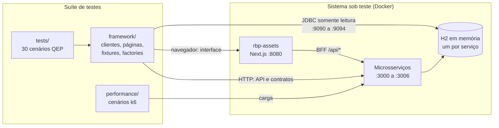
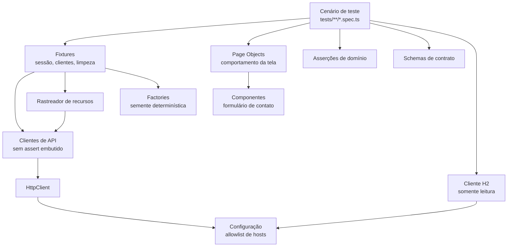
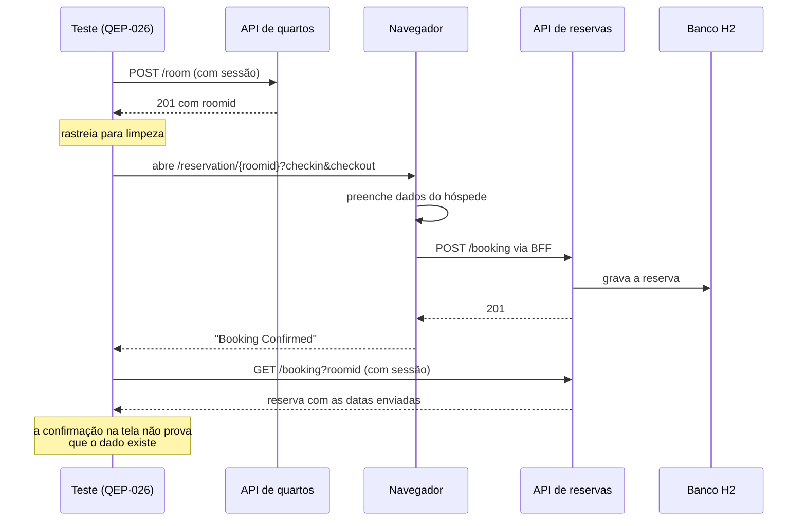
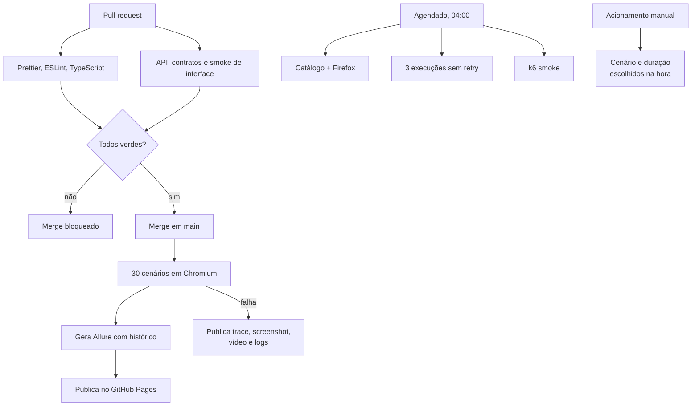

# Arquitetura

## Visão geral

O ponto que a figura torna evidente: **a suíte fala com as três camadas**, e é
isso que permite provar uma afirmação em vez de apenas repeti-la. Uma reserva
criada na interface é confirmada pela API, e um valor gravado pela API é
confirmado no banco. Verificar uma escrita pela mesma camada que a fez seria
circular.

## Camadas do framework

### Por que cada peça existe

**Clientes de API sem assert.** Um cliente que valida status por conta própria
decide, no lugar do teste, o que é falha. Em QEP-003 um 403 é o resultado
esperado; em QEP-004 seria defeito. Só o cenário sabe a diferença.

**Page Objects de comportamento.** A página de login expõe `entrar` e
`mensagemDeErro`, não um getter por campo. Um Page Object que espelha o HTML
precisa mudar a cada ajuste de layout, mesmo quando o comportamento não mudou.

**Factories com semente.** A semente vem da configuração e é combinada ao
índice do worker. A mesma execução produz os mesmos dados, e workers paralelos
nunca geram a mesma sequência — determinismo e isolamento ao mesmo tempo.

**Rastreador de recursos.** Registra o que o teste criou e remove em ordem
inversa no teardown, inclusive quando o teste falha. Resíduo de teste quebrado
contamina os seguintes e mascara defeitos reais.

**Cliente H2 isolado.** O acesso ao banco é somente leitura e roda em container.
O detalhamento está no [ADR 0003](decisions/adr-0003-acesso-ao-banco.md).

## Jornada principal ponta a ponta

## Fluxo de CI/CD

Stress, pico e soak nunca disparam sozinhos. São caros, e um disparo acidental
tem consequência real.

## Decisões registradas

| ADR                                                    | Decisão                                                     |
| ------------------------------------------------------ | ----------------------------------------------------------- |
| [0001](decisions/adr-0001-camada-de-api.md)            | Testes de API atacam os microsserviços, não o BFF           |
| [0002](decisions/adr-0002-contrato-de-autenticacao.md) | Contrato de autenticação verificado no cabeçalho            |
| [0003](decisions/adr-0003-acesso-ao-banco.md)          | Acesso ao banco por ferramenta JDBC em container            |
| [0004](decisions/adr-0004-licenciamento.md)            | MIT neste repositório, SUT como dependência externa GPL-3.0 |
